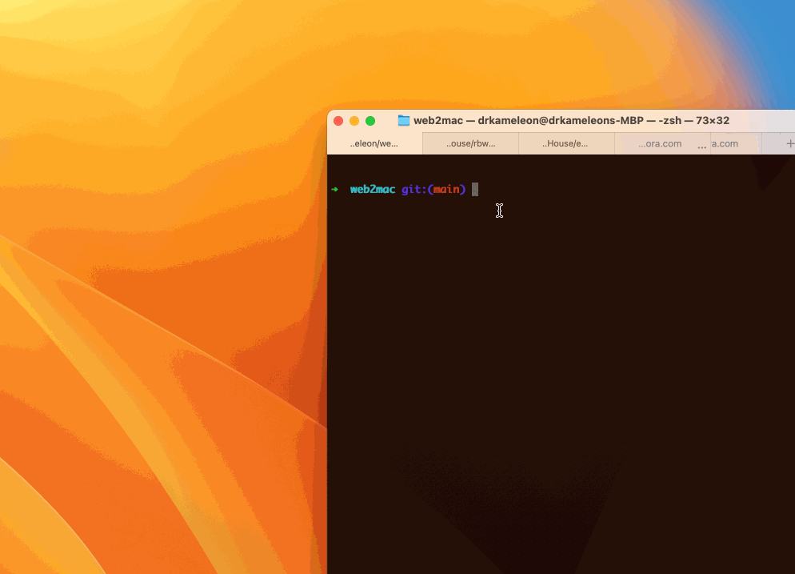

# Web2Mac

**Convert any website/URL into a valid macOS app**

The whole thing works by wrapping Arturo's own Webview implementation and creating a macOS-compliant `.app` bundle, so that you can launch any website as a standalone app - or put it into your Dock. ;-)

> [!TIP] 
> The final app "weighs" pretty much as much Arturo's binary itself; that is... a bit **less than 10MB** (and it's going to drop even more 😉)



## Usage

```bash
./web2mac.art YouTube https://youtube.com
```
